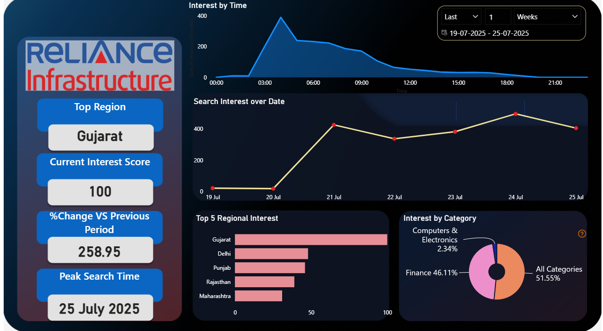

# Reliance Infra – Google Trends Analytics Dashboard
## Overview
This project tracks real‑time public search interest for Reliance Infra share price using Google Trends data.
It extracts data programmatically with Python, performs exploratory data analysis (EDA), and builds an interactive Power BI dashboard to visualize insights.

The pipeline is automated for daily refresh, making it useful for investors, analysts, and market researchers to monitor market buzz and investor sentiment.

## Key Features
Automated Data Extraction (via pytrends):

Interest over time (minute/hourly level trends)

Interest by region (state‑wise data)

Interest by categories (e.g., Finance, Business, News)

## Exploratory Data Analysis (EDA):

Detects spikes and patterns in search behavior.

Highlights top performing regions and categories.

## Interactive Power BI Dashboard:

Current Interest Score (latest day)

% Change vs Previous Day

Peak Search Time

Top Region

Top Category

Automated Refresh:

Daily execution via Windows Task Scheduler

Power BI Service Scheduled Refresh

## Business Questions Answered
How is public interest changing?
Are people searching more for Reliance Infra compared to yesterday?

When are people searching the most?
What times of the day see the highest spikes?

Where is the interest coming from?
Which Indian states are driving search interest?

What categories drive the search?
Is the interest coming from finance, business, or other contexts?

Can this signal market activity?
Are search spikes correlated with news events or stock movements?

## Tech Stack
Python: pytrends, pandas, matplotlib, seaborn

Power BI: Interactive dashboard & KPIs

## Automation:

Windows Task Scheduler for Python script automation

Power BI Service for scheduled dashboard refresh

## Project Workflow
1. Data Extraction
python
Copy
Edit
from pytrends.request import TrendReq
pytrends = TrendReq(hl='en-GB', tz=330)
pytrends.build_payload(kw_list=['reliance infra share price'], timeframe='now 1-d', geo='IN')
data = pytrends.interest_over_time()
data.to_csv('reliance_trends_time.csv', index=False)
Outputs:

reliance_trends_time.csv – Interest over time

reliance_trends_region.csv – Interest by region

reliance_trends_category.csv – Interest by category

2. EDA & Insights
Identify peak search times

Compare search volumes across categories

Map top contributing states

3. Power BI Dashboard
Visuals Created:

Line charts → Interest over time

Maps → Top regions

KPIs → Current interest, % change

Bar charts → Top categories

4. Automation
Windows Task Scheduler: Runs the Python script daily

Power BI Scheduled Refresh: Auto‑updates dashboard

Dashboard Overview:

KPI Cards:

How to Run
1. Clone the repository
bash
Copy
Edit
git clone https://github.com/yourusername/reliance-trends-dashboard.git
2. Install dependencies
bash
Copy
Edit
pip install pandas pytrends matplotlib seaborn
3. Run the script
bash
Copy
Edit
python scripts/Reliance_Infra.py
4. Load into Power BI
Open Power BI → Import the CSVs from /data

Refresh to view latest data
